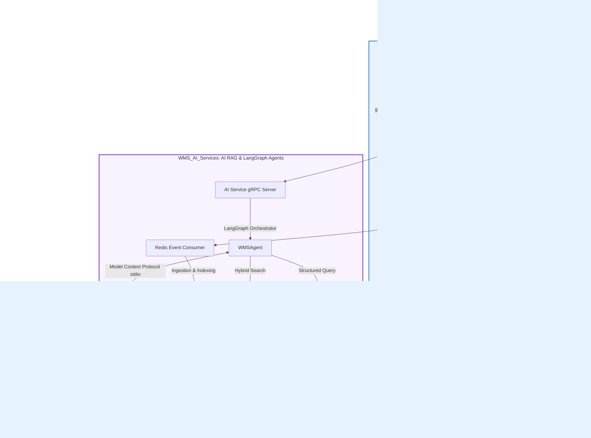

# 📦 Hướng Dẫn Hệ Sinh Thái WMS (AI-Native Warehouse Orchestration Platform)

Chào mừng bạn đến với tài liệu hướng dẫn tổng quan và chi tiết về **Hệ sinh thái WMS (Warehouse Management System)**. Dự án này được thiết kế và xây dựng theo hướng **AI-Native**, ứng dụng các công nghệ AI hiện đại nhất hiện nay như **Model Context Protocol (MCP)**, **LangGraph Agentic Workflows**, và **Hybrid RAG** nhằm tự động hóa và thông minh hóa vận hành kho bãi.

Tài liệu này được viết nhằm giúp bạn - một lập trình viên hoặc kỹ sư AI - nhanh chóng nắm bắt bức tranh toàn cảnh, hiểu cách các thành phần giao tiếp, và định hình được lộ trình đọc hiểu cũng như phát triển dự án này một cách dễ dàng nhất.

---

## 🧭 Bản Đồ Kiến Trúc Hệ Hệ Sinh Thái (Ecosystem Blueprint)

Hệ sinh thái WMS được xây dựng dưới dạng **Monorepo / Decoupled Workspace** gồm 3 dự án con (Git submodules) hoạt động độc lập nhưng phối hợp nhịp nhàng với nhau:



---

## 🧩 Khám Phá Chi Tiết Từng Thành Phần (Component Deep-Dive)

### 1. ⚙️ `WMS_Core` - Trái Tim Nghiệp Vụ Kho Bãi
Nằm tại [WMS_Core](file:///home/avandall1999/Projects/WMS_Root/WMS_Core), đây là hệ thống backend truyền thống được xây dựng cực kỳ bài bản theo triết lý **Clean Architecture** và **Domain-Driven Design (DDD)**.
* **Công nghệ chính**: FastAPI, gRPC, PostgreSQL, Redis Streams, Alembic, OpenTelemetry.
* **Cơ chế lưu trữ độc lập (Service-owned Data)**: Mỗi service (như `inventory-service`, `warehouse-service`, `product-service`) sở hữu cơ sở dữ liệu riêng biệt. Chúng tuyệt đối không truy cập database của nhau mà giao tiếp qua **gRPC** (đồng bộ) hoặc **Redis Streams** (bất đồng bộ).
* **Điểm chạm AI (AI integration points)**: 
  * `api-gateway` đóng vai trò proxy chuyển tiếp câu hỏi từ user đến `ai-service` qua gRPC ở cổng `50059`.
  * Endpoint `POST /api/v1/ai/backend-query` được phơi bày riêng cho AI để nhận các query template có cấu trúc (structured templates) nhằm trích xuất dữ liệu vận hành an toàn.

### 2. 🧠 `WMS_AI_Services` - Trung Não Trí Tuệ Nhân Tạo
Nằm tại [WMS_AI_Services](file:///home/avandall1999/Projects/WMS_Root/WMS_AI_Services), chịu trách nhiệm thực hiện các tác vụ RAG nặng, agentic reasoning, trích xuất prompt template và fine-tuning.
* **Công nghệ chính**: LangGraph, LangChain, ChromaDB, Groq API, PyTorch, LoRA.
* **Kiến trúc AI Engine (`ai_engine`)**:
  * **Processing Modes**: Hỗ trợ 3 chế độ xử lý chính:
    1. **RAG Mode**: Trả lời các câu hỏi về tài liệu, quy trình hướng dẫn kho bãi bằng cơ chế Hybrid Retrieval (kết hợp vector embedding `all-MiniLM-L6-v2` và thuật toán tìm kiếm từ khóa `BM25`).
    2. **Agent Mode**: Chạy Agent thông minh bằng **LangGraph**, liên kết trực tiếp với database thông qua các công cụ nghiệp vụ được tăng cường.
    3. **Hybrid Mode**: Tự động chuyển đổi thông minh giữa RAG (đối với câu hỏi kiến thức) và Agent (đối với câu hỏi dữ liệu vận hành).
  * **LangGraph Agent Workflow**: Định nghĩa một chu trình suy luận khép kín:
    $$\text{Agent (LLM)} \rightarrow \text{should\_continue} \rightarrow \text{Tools Execution} \rightarrow \text{Agent (LLM)} \rightarrow \text{Response}$$
  * **Fine-Tuning Workflow**: Hệ thống hỗ trợ tự huấn luyện mô hình ngôn ngữ nhỏ (SLM) thông qua kỹ thuật LoRA để chuyển hóa ngôn ngữ tự nhiên của người dùng thành cấu trúc JSON Query có dạng `{intent, target, filters, metrics}`. Bộ dataset huấn luyện nằm tại `training/fine_tuning/data/wms_data_enriched.jsonl` có hỗ trợ cả tiếng Anh lẫn tiếng Việt.

### 3. 🔌 `WMS_MCP_Server` - Cầu Nối Giữa LLM và Hệ Thống Vận Hành
Nằm tại [WMS_MCP_Server](file:///home/avandall1999/Projects/WMS_Root/WMS_MCP_Server), đây là một thành phần cực kỳ quan trọng biến toàn bộ dự án này thành **AI-Native**.
* **Model Context Protocol (MCP)**: Là giao thức mã nguồn mở do Anthropic phát triển, giúp các mô hình ngôn ngữ lớn (LLM) tương tác một cách an toàn và có kiểm soát với các hệ thống bên ngoài (như files, databases, APIs).
* **Danh sách 19 Công Cụ Nghiệp Vụ (Tools)**: MCP Server đóng vai trò cung cấp các tool này dưới dạng stdio hoặc SSE transport. Các tool được phân lớp rõ ràng:
  * *Phân lớp 1 (Inventory & Slotting)*: Kiểm tra tồn kho theo SKU (`check_stock_availability`), phân tích ABC (`abc_analysis_report`), tối ưu vị trí xếp hàng (`smart_slotting_optimizer`).
  * *Phân lớp 2 (Transactions & Movements)*: Điều chỉnh số lượng hàng (`update_inventory_quantity`), dịch chuyển kho (`move_stock_between_locations`).
  * *Phân lớp 3 (Concurrency & Monitoring)*: Kiểm tra khóa phân tán Redis (`check_redis_locks`), kiểm tra hàng đợi (`view_message_queue_status`).
  * *Phân lớp 4 & 5 (Advanced Subsystems)*: Tần suất lấy hàng (`generate_picking_route`), gợi ý hộp đóng gói (`suggest_packing_box`), xác thực đơn mua hàng (`verify_incoming_po`).

---

## 🔄 Phân Tích Các Luồng Dữ Liệu AI-Native (Data Flows)

Để hiểu sâu sắc dự án này, bạn cần nắm rõ hai luồng dữ liệu cốt lõi dưới đây:

### Luồng 1: Tiếp nhận và xử lý truy vấn thông minh (Query Flow)
Khi người dùng nhập: *"Kiểm tra cho tôi xem mặt hàng Laptop Pro (LAP-001) còn bao nhiêu chiếc và nên xếp đợt hàng mới vào đâu?"*

```
[User] ──(1. Ask Question)──> [api-gateway]
                                  │
                          (2. gRPC wms.ai.v1.AIService/Query)
                                  │
                                  ▼
                         [ai-service (gRPC)]
                                  │
                     (3. Route & Process: HYBRID Mode)
                                  │
                     ┌────────────┴────────────┐
                     ▼ (RAG path)              ▼ (Agent path - LangGraph)
             [Hybrid Retrieval]            [WMSAgent (Groq/Fine-tuned)]
             - ChromaDB Vector Search                  │
             - BM25 Keyword Search             (4. Call MCP tools)
                     │                                 │
                     │                                 ▼
                     │                        [WMS MCP Server]
                     │                        - check_stock_availability(LAP-001)
                     │                        - smart_slotting_optimizer(LAP-001)
                     │                                 │
                     ▼                                 ▼
             [LLM Synthesis] <────────────────[Return Tool Results]
                     │
            (5. Return Unified Response)
                     │
                     ▼
[User] <── "Hiện tại LAP-001 còn 45 chiếc tại Zone A. Lô hàng mới nên xếp vào Zone A-02..."
```

### Luồng 2: Đồng bộ hóa dữ liệu Vector DB bất đồng bộ (Reindexing Flow)
Để đảm bảo AI service không truy cập trực tiếp vào DB vận hành và làm chậm hệ thống, dữ liệu được cập nhật thông qua cơ chế Event-driven:
1. Khi có bất kỳ thay đổi nào về kho bãi (nhập, xuất, dịch chuyển), `inventory-service` phát ra event (ví dụ: `InventoryMovementApplied`) lên **Redis Streams** (`wms.events`).
2. Bộ tiêu thụ sự kiện `EventConsumer` trong `WMS_AI_Services` lắng nghe stream này.
3. Sự kiện được chuyển đổi thành một reindex job trong hàng đợi `ai_service.pipeline.ingestion`.
4. Pipeline tiến hành cập nhật vector DB (ChromaDB) và chỉ mục từ khóa (BM25) tương ứng để phục vụ cho các truy vấn RAG tiếp theo.

---

## 🗺️ Hướng Dẫn Từng Bước Cho Lập Trình Viên (Developer Roadmap)

Nếu bạn muốn đọc hiểu dự án này cặn kẽ và bắt đầu sửa đổi code, hãy đi theo lộ trình sau:

### Lộ Trình 1: Đọc Hiểu Cấu Trúc Code (Code Walkthrough)
1. **Tìm hiểu Core Contract**: Đọc các file định nghĩa gRPC Protobuf tại [proto/](file:///home/avandall1999/Projects/WMS_Root/WMS_Core/proto) để hiểu giao thức giao tiếp giữa các service.
2. **Khám phá các MCP Tools**: Đọc file cấu trúc đăng ký tool [registry.py](file:///home/avandall1999/Projects/WMS_Root/WMS_MCP_Server/app/tools/registry.py), sau đó xem ví dụ một tool cụ thể như [inventory tools](file:///home/avandall1999/Projects/WMS_Root/WMS_MCP_Server/app/tools/inventory) để xem cách tool truy vấn PostgreSQL và trả về kết quả.
3. **Phân tích LangGraph Agent**: Xem file [wms_agent.py](file:///home/avandall1999/Projects/WMS_Root/WMS_AI_Services/src/ai_engine/agents/wms_agent.py) để hiểu cấu trúc Graph (Node, Edge, Conditional Edges) điều khiển tư duy của Agent.
4. **Xem lịch sử cải tiến bằng AI**: Đọc file [COMMIT_ANALYSIS.md](file:///home/avandall1999/Projects/WMS_Root/WMS_Core/COMMIT_ANALYSIS.md) để học cách các lỗi về environment, timeout và tracing được giải quyết từng bước như thế nào trong quá trình phát triển bằng AI.

### Lộ Trình 2: Chạy Thử và Tương Tác
1. **Khởi động toàn bộ Stack (bao gồm cả AI Services)**:
   ```bash
   cd WMS_Core
   docker compose --profile ai up -d --build
   ```
2. **Kiểm tra sức khỏe của AI Service**:
   ```bash
   curl http://localhost:8009/health
   ```
3. **Chạy thử MCP Server cục bộ**:
   ```bash
   cd WMS_MCP_Server
   uv sync
   python main.py
   ```
4. **Chạy thử script Fine-tuning**:
   Để hiểu cách hệ thống sinh dataset và train model:
   ```bash
   cd WMS_AI_Services
   uv run python training/fine_tuning/build_enriched_dataset.py
   ```

### Lộ Trình 3: Cách Mở Rộng Hệ Thống
* **Muốn thêm một công cụ mới cho AI?**
  1. Viết class tool kế thừa từ `BaseTool` trong thư mục tương ứng tại `WMS_MCP_Server/app/tools/`.
  2. Đăng ký tool trong hàm `register_..._tools()` tương ứng.
  3. LLM hoặc LangGraph Agent kết nối qua MCP sẽ tự động nhận diện và sử dụng được tool mới này mà không cần sửa code phía Agent.
* **Muốn cải tiến Agent?**
  1. Vào [wms_agent.py](file:///home/avandall1999/Projects/WMS_Root/WMS_AI_Services/src/ai_engine/agents/wms_agent.py).
  2. Bổ sung các Node xử lý mới (ví dụ: Node kiểm duyệt an toàn thông tin - guardrails, Node tự sửa lỗi truy vấn) vào `StateGraph`.

---

## 🏆 Đánh Giá: Tại Sao Đây Là Dự Án AI-Native Tiêu Biểu?

1. **Decoupled Architecture (Kiến trúc phi tập trung)**: AI không truy cập trực tiếp vào DB nghiệp vụ. Nó giao tiếp thông qua API có cấu trúc hoặc MCP. Điều này đảm bảo tính an toàn hệ thống cao và dễ dàng bảo trì.
2. **Model Agnostic (Không phụ thuộc mô hình)**: Bạn có thể sử dụng Groq (cho tốc độ phản hồi cực nhanh dưới 1 giây) hoặc nạp một mô hình local đã fine-tuned bằng LoRA thông qua biến môi trường `FINE_TUNED_MODEL_PATH`.
3. **Cơ Chế MCP Đa Dạng**: Việc phơi bày 19 tools nghiệp vụ giúp AI có khả năng hành động thực sự (Actionable AI) thay vì chỉ dừng lại ở mức độ trò chuyện giải đáp thông tin (Chatbot).

Hy vọng tài liệu này mang lại cho bạn cái nhìn rõ ràng và truyền cảm hứng để bắt đầu làm chủ hệ sinh thái WMS AI-Native này!
