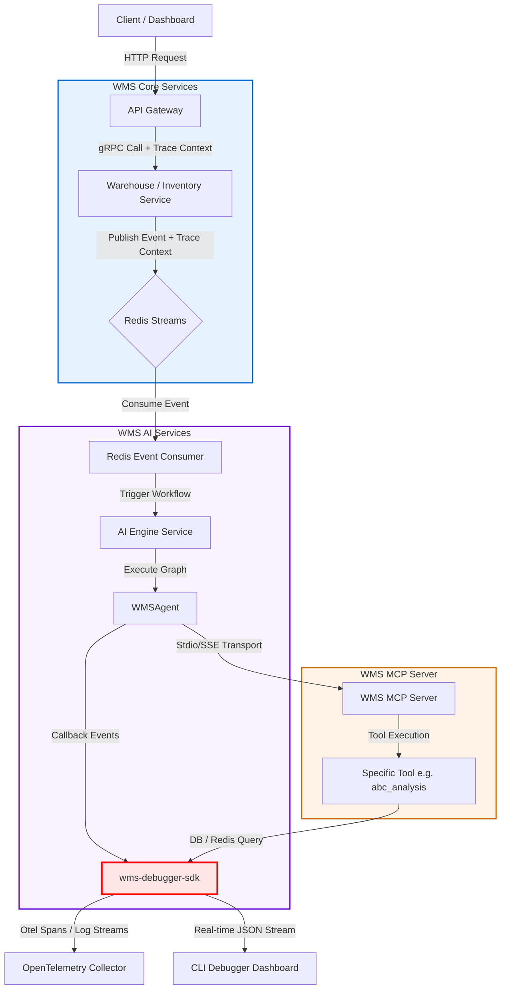

# 🛠️ WMS Ecosystem Debugger SDK - Architecture & Implementation Plan

Tài liệu này đề xuất thiết kế kiến trúc và kế hoạch triển khai cho **WMS Debugger SDK (`wms-debugger-sdk`)**. Đây là bộ công cụ hỗ trợ nhà phát triển gỡ lỗi, kiểm thử, và giám sát toàn bộ các luồng giao dịch phân tán từ API Gateway, gRPC Microservices, Event Bus (Redis Streams), cho đến các tác vụ trí tuệ nhân tạo (LangGraph AI Agents & Model Context Protocol - MCP Tools).

---

## 1. Bối cảnh & Bài toán (Context & Problem Statement)

Hệ sinh thái WMS hiện tại được xây dựng theo kiến trúc Microservices bất đồng bộ và AI-native:
1. **gRPC-first**: Truyền thông đồng bộ giữa các services (API Gateway -> Business Services).
2. **Event-driven (Redis Streams)**: Truyền thông bất đồng bộ qua event bus (`wms.events`).
3. **AI-native (LangGraph & MCP)**: Tác vụ Agentic AI tự động ra quyết định bằng đồ thị trạng thái và gọi các MCP tools để tương tác với cơ sở dữ liệu.

### Thách thức trong việc Gỡ lỗi (Debugging Challenges)
* **Truy vết Phân tán bị ngắt quãng**: Việc một request đi qua API Gateway, kích hoạt gRPC service, phát sinh event trên Redis Stream, và sau đó được tiêu thụ bởi AI Service để chạy Agent là một luồng rất dài. Nếu xảy ra lỗi hoặc nghẽn, rất khó định vị chính xác điểm lỗi (Root cause) nếu thiếu cơ chế chia sẻ Trace Context đồng bộ.
* **Hộp đen LangGraph Agent**: LLM Agent thực thi qua các node trong StateGraph. Các biến trạng thái thay đổi liên tục, và việc ghi log truyền thống (`logging.info`) không đủ trực quan để theo dõi xem Node nào đã chỉnh sửa thông tin gì và tại sao LLM lại đưa ra quyết định sai.
* **Cô lập lỗi MCP Tools**: Có tới 19 nghiệp vụ phức tạp được phơi bày qua MCP Server. Việc kiểm thử các tool này yêu cầu kết nối DB thực tế hoặc các điều kiện lock phân tán của Redis.

---

## 2. Luồng Dữ liệu & Sơ đồ Kiến trúc (Data Flow & Architecture Blueprint)

Dưới đây là sơ đồ Mermaid mô tả luồng hoạt động của **WMS Debugger SDK** khi tích hợp vào toàn bộ hệ sinh thái:



### Nguyên tắc hoạt động (Core Mechanism)
* **Unified Context Propagation**: Debugger SDK sẽ tận dụng giao thức OpenTelemetry (`traceparent` W3C format) để đóng gói và truyền tải ngữ cảnh xử lý qua các ranh giới giao tiếp (HTTP $\rightarrow$ gRPC $\rightarrow$ Redis Streams $\rightarrow$ LangGraph $\rightarrow$ MCP Tools).
* **Hook-based Observation**: Thay vì sửa trực tiếp mã nguồn nghiệp vụ, SDK cung cấp các decorator, middleware và callback để tự động chặn (intercept) và ghi nhận dữ liệu tại các điểm khớp nối quan trọng.

---

## 3. Kiến trúc Chi tiết các Thành phần SDK (Component Architecture)

Bộ SDK sẽ được cấu trúc dưới dạng một thư viện dùng chung, đặt trong [shared-utils](file:///home/avandall1999/Projects/WMS_Root/shared-utils) tại module `shared_utils/debugger`.

### 3.1. gRPC Payload & Context Interceptor
* **Chức năng**: Tự động trích xuất `traceparent` và `x-request-id` từ gRPC metadata, đồng thời ghi lại nội dung (payload) gửi đi/nhận về của gRPC.
* **Thiết kế**:
  * Kế thừa `grpc.ServerInterceptor` cho phía server và `grpc.UnaryUnaryClientInterceptor` cho phía client.
  * Tự động mã hóa (masking) các thông tin nhạy cảm (như mật khẩu, token JWT trong header authorization) trước khi chuyển vào hệ thống log hoặc trace.

### 3.2. Redis Streams Trace Envelope
* **Chức năng**: Đồng bộ hóa Trace Context qua cơ chế Pub/Sub bất đồng bộ.
* **Thiết kế**:
  * **Publisher Wrapper**: Khi đẩy một event lên Redis Stream qua lệnh `XADD`, SDK sẽ tự động bao bọc (envelope) payload vào một cấu trúc chuẩn:
    ```json
    {
      "metadata": {
        "traceparent": "00-4bf92f3577b34da6a3ce929d0e0e4736-00f067aa0ba902b7-01",
        "timestamp": "2026-07-14T08:15:00Z",
        "producer": "inventory-service"
      },
      "data": {
        "sku": "LAP-001",
        "quantity": 10
      }
    }
    ```
  * **Consumer Wrapper**: Trích xuất `traceparent` từ metadata và kích hoạt một OpenTelemetry Span con tương ứng cho luồng xử lý sự kiện phía Consumer.

### 3.3. LangGraph State & Transition Debugger
* **Chức năng**: Ghi nhận chi tiết từng bước chuyển đổi trạng thái của AI Agent.
* **Thiết kế**:
  * Tạo class `WMSLangGraphDebugger` kế thừa từ `BaseCallbackHandler` của LangChain.
  * Lắng nghe các sự kiện:
    * `on_chain_start`: Khi Agent bắt đầu chạy.
    * `on_llm_start` & `on_llm_end`: Theo dõi nội dung prompt gửi tới Groq Cloud và kết quả suy luận thô (raw completion), ghi nhận token sử dụng.
    * `on_tool_start` & `on_tool_end`: Theo dõi thời gian chạy và kết quả phản hồi của MCP Tools.
    * `on_chain_end`: So sánh sự khác biệt của `AgentState` trước và sau khi đi qua mỗi node (State Diff Tracking).

### 3.4. MCP Sandbox & Mock Controller
* **Chức năng**: Hỗ trợ chạy giả lập MCP Tools trong môi trường local không cần phụ thuộc database thực tế.
* **Thiết kế**:
  * Cung cấp một Mock DB Manager (sử dụng SQLite in-memory).
  * Cho phép thiết lập các mock state (ví dụ: tạo sẵn một Redis Lock cụ thể để kiểm tra xem tool `check_redis_locks` hoạt động chính xác hay không).

---

## 4. Liên kết với Chuẩn 12-Factor App & Clean Architecture

### 4.1. 12-Factor App Alignment
* **Factor 3: Config (Cấu hình môi trường)**: 
  Mọi hành vi kích hoạt debugger đều được kiểm soát qua biến môi trường. Tuyệt đối không hardcode cấu hình bật/tắt hay địa chỉ server nhận log:
  ```env
  WMS_DEBUG_ENABLED=true                # Bật/tắt SDK
  WMS_DEBUG_EXPORTER=console|otlp|file   # Nơi gửi dữ liệu trace
  WMS_DEBUG_COLLECTOR_URL=http://otel-collector:4317
  WMS_DEBUG_MASK_FIELDS=password,token,jwt_token
  ```
* **Factor 11: Logs (Dòng sự kiện log)**:
  SDK coi telemetry là dòng sự kiện liên tục. Nó ghi trực tiếp ra `stdout`/`stderr` dưới dạng JSON định dạng chuẩn (Structured Logging), cho phép các bộ thu thập tập trung (FluentBit, Vector) gom dữ liệu dễ dàng mà không làm ảnh hưởng tới hiệu năng ứng dụng.
* **Factor 10: Dev/Prod Parity**:
  Đảm bảo SDK hoạt động thống nhất trên máy local của developer cũng như trên Kubernetes Staging/Production, sự khác biệt duy nhất chỉ là cấu hình đầu ra của trace (`WMS_DEBUG_EXPORTER`).

### 4.2. Clean Architecture Design
* **Tách biệt ranh giới (Decoupled boundaries)**: 
  Debugger SDK chỉ đóng vai trò là một Adapter nằm ngoài cùng của hệ thống. Các tầng nghiệp vụ cốt lõi (Domain, Use Cases) không được phép import trực tiếp SDK này. SDK sẽ đăng ký thông qua cơ chế Dependency Injection hoặc Context Managers khi khởi chạy dịch vụ (Service Bootstrap).

---

## 5. Kế hoạch & Lộ trình Triển khai (Implementation Roadmap)

Quá trình phát triển sẽ được chia làm 4 giai đoạn cụ thể:

### 🚀 Giai đoạn 1: Xây dựng Core SDK & gRPC Interceptor (Tuần 1)
* [ ] Thiết lập cấu trúc thư mục tại `shared-utils/src/shared_utils/debugger`.
* [ ] Viết cấu hình `Pydantic` đọc biến môi trường cho SDK.
* [ ] Hiện thực hóa bộ lọc thông tin nhạy cảm (Payload Masking).
* [ ] Viết `GrpcObservabilityInterceptor` hỗ trợ ghi nhận Request/Response JSON payload.

### 🔄 Giai đoạn 2: Tích hợp Redis Streams & Event Context (Tuần 2)
* [ ] Định nghĩa schema cho Event Envelope (chứa metadata trace).
* [ ] Viết wrapper cho `RedisStreamPublisher` và `RedisStreamConsumer` để tự động đính kèm/trích xuất Trace ID.
* [ ] Viết unit test giả lập gửi nhận event qua `aiosqlite` / Mock Redis.

### 🧠 Giai đoạn 3: Hiện thực hóa LangGraph & MCP Debugger (Tuần 3)
* [ ] Xây dựng `WMSLangGraphDebuggerCallback` để bắt các sự kiện node, tool, LLM.
* [ ] Triển khai hàm tính toán sự thay đổi state (`state_diff_calculator`).
* [ ] Viết test suite chạy kiểm thử Agent cục bộ và xuất ra mã JSON mô tả đường đi của Agent.

### 🖥️ Giai đoạn 4: Xây dựng CLI Dash & Tích hợp OpenTelemetry (Tuần 4)
* [ ] Viết một CLI tool đơn giản `wms-debug-cli` bằng thư viện `Rich` hoặc `Textual` để xem live-stream trace.
* [ ] Kết nối dữ liệu từ SDK sang OpenTelemetry Collector cục bộ (chạy cổng `4317` trong Docker Compose).
* [ ] Viết tài liệu hướng dẫn sử dụng (Developer Quickstart).

---

## 6. Kế hoạch Xác minh (Verification Plan)

### Kiểm thử Tự động (Automated Tests)
* Chạy test suite giả lập một request đi qua 3 hop (API Gateway -> gRPC Service -> Redis Event -> AI Agent), sau đó assert xem Trace ID có được giữ nguyên trên tất cả các chặng hay không:
  ```bash
  pytest shared-utils/tests/debugger/test_trace_propagation.py
  ```

### Xác minh Thủ công (Manual Verification)
1. Bật dashboard OpenTelemetry (Jaeger/Zipkin hoặc Prometheus/Grafana) chạy cục bộ.
2. Gửi một câu hỏi AI qua endpoint `/api/v1/ai/query` trên API Gateway.
3. Kiểm tra trace graph hiển thị trên UI Jaeger để chắc chắn toàn bộ quá trình thực thi từ gRPC đến các node LangGraph và MCP tool được hiển thị liền mạch dưới dạng một cây Trace hợp nhất.
